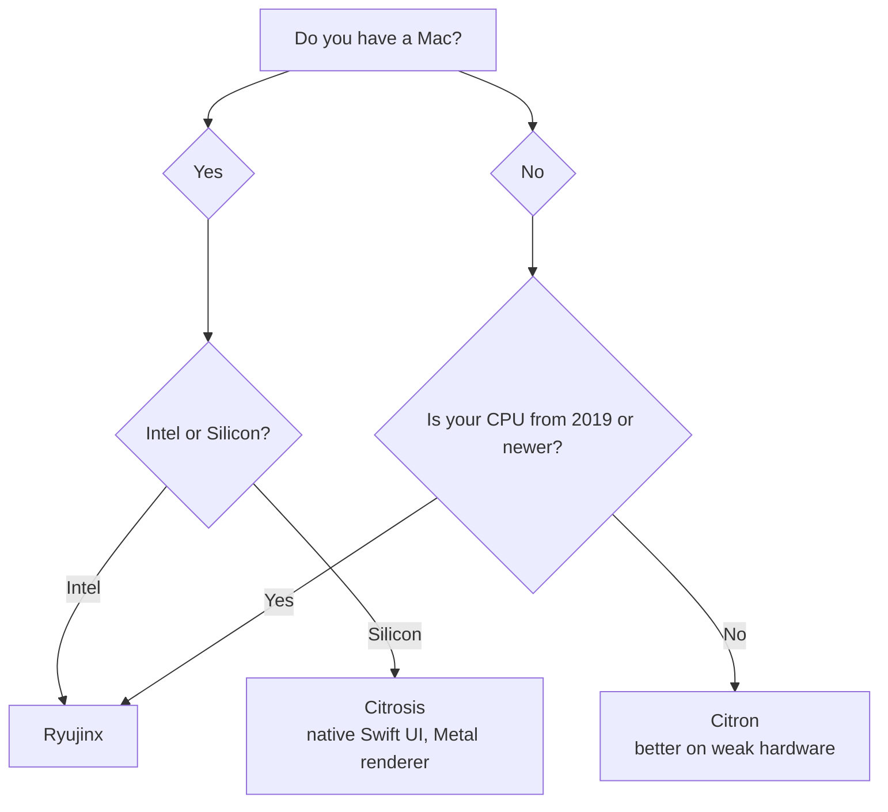

=====

# Welcome to GRID0

## Where To Go

**I want to play on...**
- 🖥️ [Emulator (PC / Steam Deck)](#1-emulator-setup-grid0-emu-) - Ryujinx, Eden, Astris, etc.
  - [Windows setup](#windows)
  - [macOS setup](#macos)
  - [Linux setup](#linux)
  - [Emulator network settings](#emulator-settings-all-platforms)
- 🔧 [Modded Switch (Atmosphère)](#2-modded-switch-grid0-cfw) - runs on the console, no PC needed
- 🎮 [Stock Switch / Switch 2](#3-stock-switch-and-switch-2-setup-grid0-ofw) - unmodded hardware via PC relay
  - [Automatic mode (Windows Hotspot)](#automatic-mode-easier-windows-and-hotspot-capable-only)
  - [Manual mode](#manual-mode)

**I want to learn about...**
- [What GRID0 is](#what-is-grid0)
- [What GRID0+ is](#what-is-grid0-plus)
- [The three ecosystems](#services)
- [Who runs this](#project-owners)

## Setup Guides

### 1. Emulator Setup (GRID0+ emu)

#### Which emulator should I use?

<b>PC Flowchart</b>

<b>Android Flowchart</b>

Are you using a Mac?

<b>Yes</b>

<b>Intel or Silicon?</b>

- <b>Intel</b> → [**Ryujinx**](https://github.com/GRID0-net/GRID0-ryu)
- <b>Silicon</b> → <b>Citrosis</b> <i>(native Swift UI, Metal renderer)</i>

<b>No</b>

<b>CPU from 2019 or newer?</b>

- <b>Yes</b> → [**Ryujinx**](https://github.com/GRID0-net/GRID0-ryu)
- <b>No</b> → [**Citron**](https://github.com/GRID0-net/GRID0-citron) <i>(better on weak hardware)</i>

<b>Emulator links</b>

- **Citrosis**: macOS Apple Silicon with native Swift UI and Metal renderer
- **Ryujinx** or **Citron**: pick from the tree above — [Ryujinx](https://github.com/GRID0-net/GRID0-ryu) for newer hardware, [Citron](https://github.com/GRID0-net/GRID0-citron) for weaker PCs

#### Windows

1. Download and install **[ZeroTier One](https://www.zerotier.com/download/)**.
2. Right-click the tray icon, select **Join New Network**, and enter:
   `8bd5124fd68185ec`

#### macOS

1. Download and install **[ZeroTier One](https://www.zerotier.com/download/)**.
2. Click the menu bar icon, select **Join New Network**, and enter:
   `8bd5124fd68185ec`

[image: the macOS menu bar showing the ZeroTier icon and the join network option]

#### Linux

1. Install ZeroTier One:
   `curl -s https://install.zerotier.com | sudo bash`
2. Join the GRID0 network:
   `sudo zerotier-cli join 8bd5124fd68185ec`

[image: a terminal showing the install and join commands with their output]

#### Emulator settings (all platforms)

1. Open your emulator settings (e.g. Ryujinx):
   * Go to **Settings → Network**.
   * Set the multiplayer **Mode** to `Disabled`.
   * Enable **Guest Internet Access/LAN Mode**
   * Remember to click **Apply** and/or **OK**.

[image: Ryujinx settings on the Network tab, with the multiplayer mode and guest internet access options highlighted]

---

### 2. Modded Switch (GRID0+ cfw)

Runs directly on the console as a background sysmodule. No PC or phone required while playing.

1. Download the latest release from the **[GRID0+ cfw](https://github.com/redluigi323/sys-GRID0/)** repository.
2. Extract the archive to the root of your SD card.

[image: the SD card root with the extracted sys-GRID0 folders in place]

3. Reboot into atmosphere, (temporary step) Currently the network id isnt included with the release, so in ultrahand, insert the following network id on the sys-zerotier page (name is also not yet updated) : 8bd5124fd68185ec
4. Verify connection status using the Tesla (or Ultrahand) overlay menu.

[image: the Tesla overlay open on the Switch showing the sys-GRID0 connection status]

---

### 3. Stock Switch and Switch 2 Setup (GRID0 ofw)

Stock consoles cannot execute background custom modules. `grid0-relay` runs on a PC connected to the same home network, capturing and translating LAN-Play packets automatically.

1. Download and open `GRID0Relay` from the **[GRID0 ofw](https://github.com/GRID0-net/GRID0-ofw)** repository.
2. `GRID0Relay` will automatically install ZeroTier One and npcap.
   <small>

For certainty:
Make sure they are installed (it should say ZeroTier One and npcap are installed in the `GRID0Relay` settings). 
   
   
</small>
3. `GRID0Relay` will automatically launch ZeroTier and connect to the GRID0 network.
   <small>

For certainty:
**Windows:** Click the Up arrow at the bottom right of your screen and right-click the ZeroTier tray icon, make sure the status is OK in `8bd5124fd68185ec` GRID0. 
   
   
</small>
4. `GRID0Relay` will automatically select the correct ZeroTier adapter.
   <small>

For certainty:
In `GRID0Relay`, open **Settings**, the relay will automatically connect to the presumed ZeroTier connection, but make sure the ZeroTier connection selected looks like the correct one (should be named something similar to ZeroTier). 
   
   
</small>

<small>

Automatic Mode (Easier, Windows and Hotspot Capable Only):

5. Go back to the **Play** section of `GRID0Relay`, make sure **Automatic (DHCP)** is selected, click **Set up PC hotspot** if it isn't already set up and click **Start relay**.

[image: the relay Play tab with Automatic (DHCP) selected and Start relay visible]

6. Connect your Switch or Switch 2 to the PC Hotspot normally. If your Switch or Switch 2 was already connected, simply turn on and off either **Sleep Mode** or **Airplane Mode** (both work).

</small>

<small>

Manual Mode:

5. Go back to the **Play** section of `GRID0Relay`, make sure **Manual IP settings** is selected, click **Start relay** and notice the Switch IP settings it provides you.
6. On your Switch or Switch 2, enter **Network Settings**, **Change Settings** on the same network your PC is connected to, and enter the provided IP settings. (Primary DNS can be set to **8.8.8.8** and Secondary DNS can be left blank).

[image: the Switch internet settings screen with the manual IP, subnet, gateway, and DNS fields filled in]
7. Make sure to save and connect to the network.

</small>

## What is GRID0

GRID0 is a virtual overlay network bridging all three Switch ecosystems into the same LAN lobby:
* **Emulators** (PC, Steam Deck)
* **CFW** (Atmosphère, Modded Switch 1)
* **OFW** (Stock Hardware, Unmodded Switch 1 and Switch 2)

it runs on ZeroTier, so your switch, your friend's emulator, and someone's modded console all end up on the same virtual LAN. games that support local wireless or LAN play just work, no nintendo servers involved.

## What is GRID0+

GRID0+ is the version that connects to custom servers instead of just doing LAN.

where GRID0 gives you the virtual network, GRID0+ gives you the online experience: lobbies, matchmaking, and in-game features like splatfests, all running on community servers instead of nintendo's.

the `+` builds (GRID0+ ryujinx, GRID0+ citron, GRID0+ cfw) are the ones with private server support baked in. point them at a GRID0+ server and you're playing online.

## Services

| Ecosystem | Platform / Environment | Core Tool | Connection Method |
| :--- | :--- | :--- | :--- |
| **Emulator** | PC / Steam Deck | **GRID0+ ryujinx  OR  GRID0+ citron** | A custom built emulator. |
| **CFW** | Modded Switch | **GRID0+ cfw** | On-device background sysmodule and homebrew app. |
| **OFW** | Unmodded Switch or Switch 2 | **GRID0 ofw** | PC companion application bridges Switch Wi-Fi traffic. |

---

## Who Runs This

- **[Mustafa](https://github.com/Musi95)**
- **[name](https://github.com/redluigi323)**
- **[Doughston](https://github.com/n-popescu)**

---

<small>GRID0 is a community project, not affiliated with Nintendo.</small>
